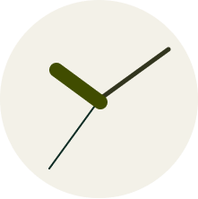
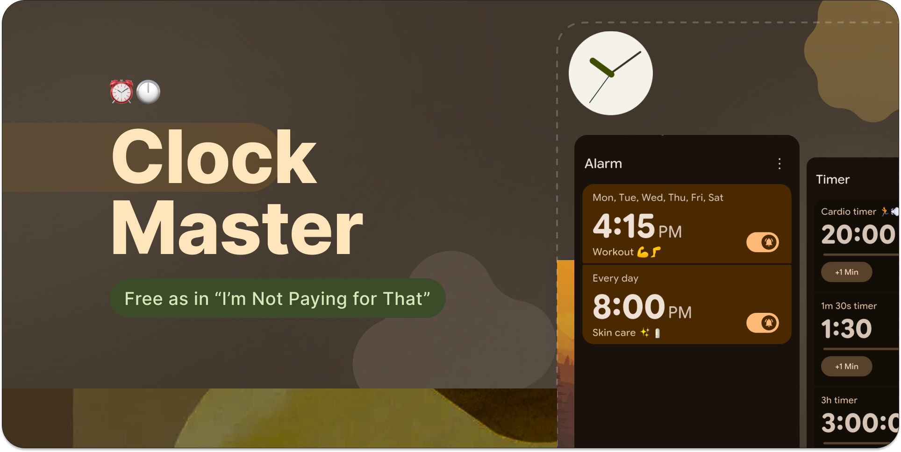
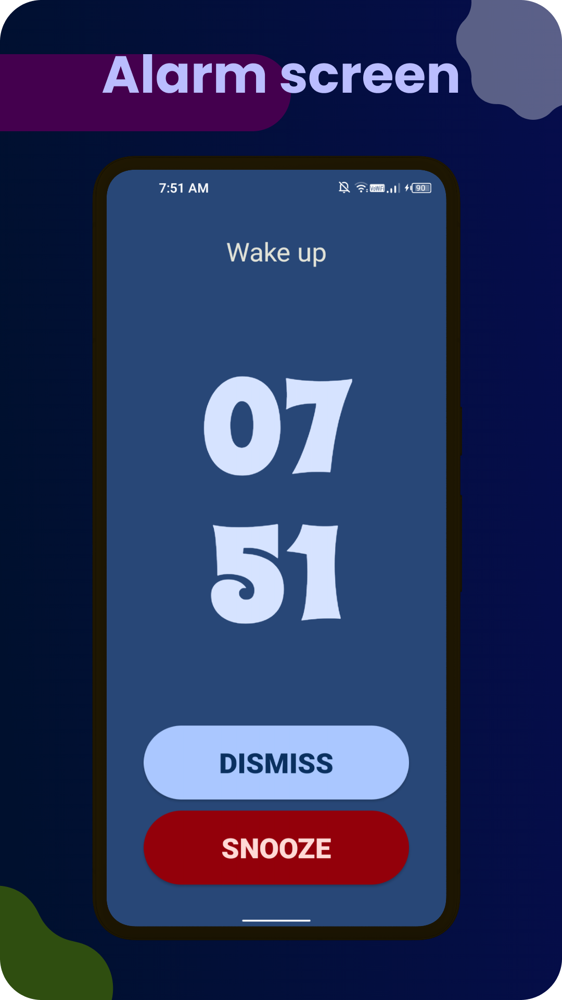
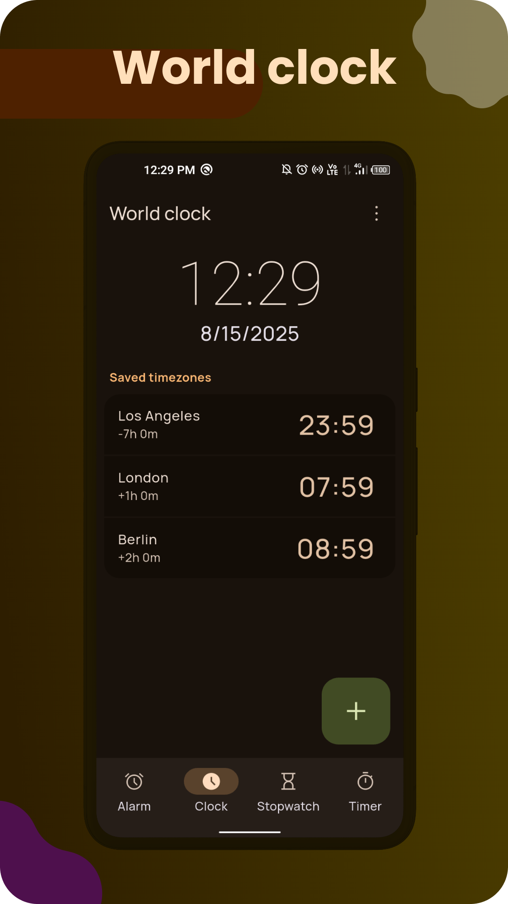
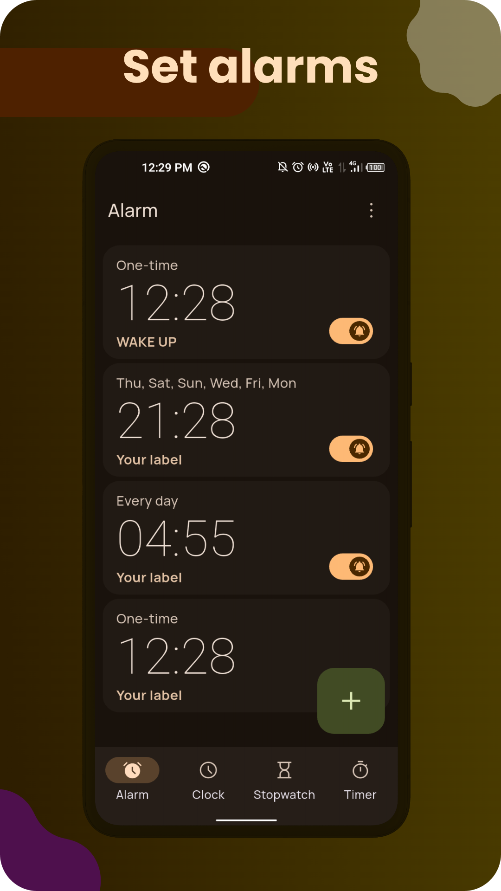
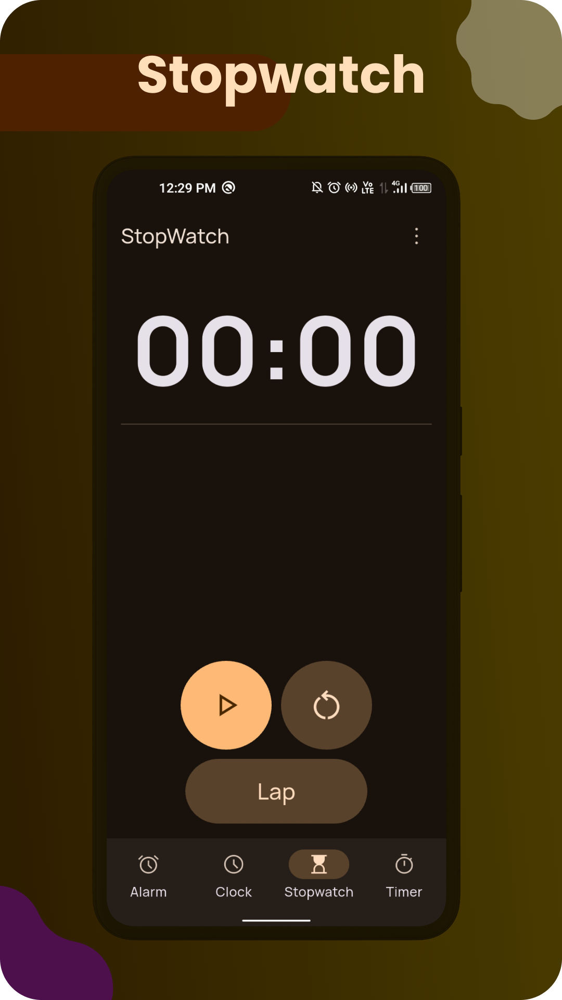
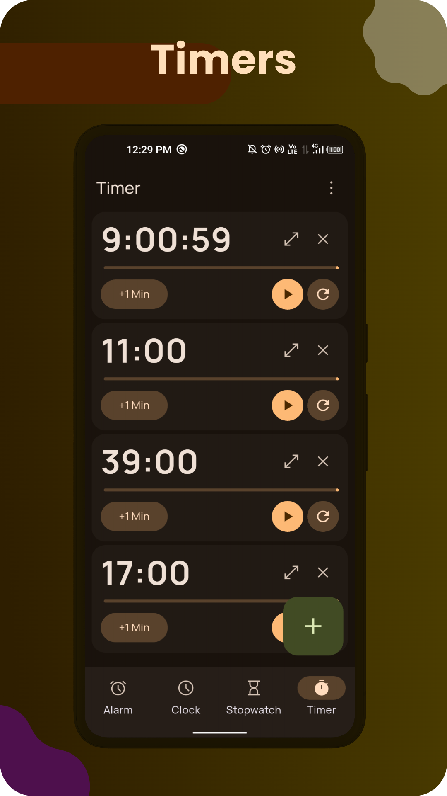
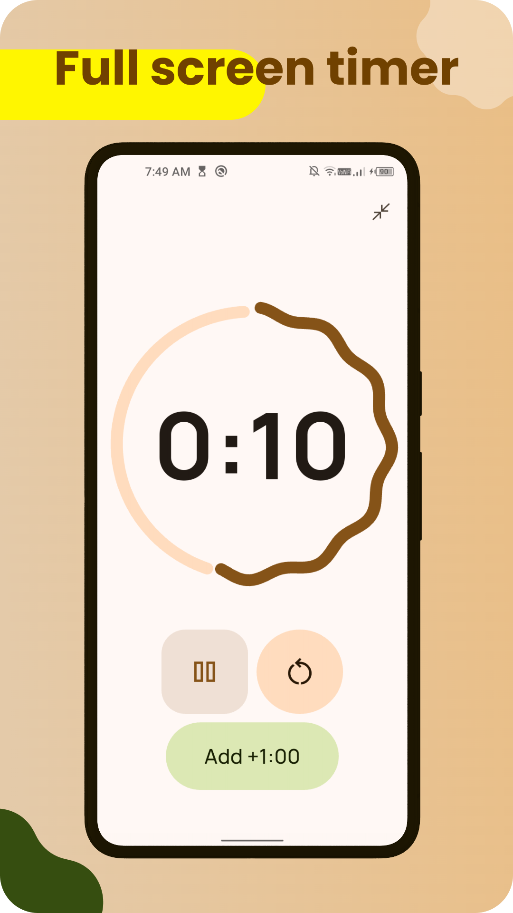

   

<h1 align="center">
 ClockPoet
</h1>
   

      
      
       
       
       

</a>
   

 

    
  [Contact](https://github.com/runtimepoet/ClockPoet?tab=readme-ov-file#contact) • [License](https://github.com/runtimepoet/ClockPoet?tab=readme-ov-file#license)
 

       

   <h3>ClockPoet: The Clock App That Looks Great and Does More</h3>
   
   

   

 

# 👁️ Screenshots

 

# ✉️ Contact

For any questions or feedback, feel free to open an issue on GitHub or contact runtimepoet910601@gmail.com

# ©️ License

This project is licensed under the Apache License 2.0. See the `LICENSE` file for details.
